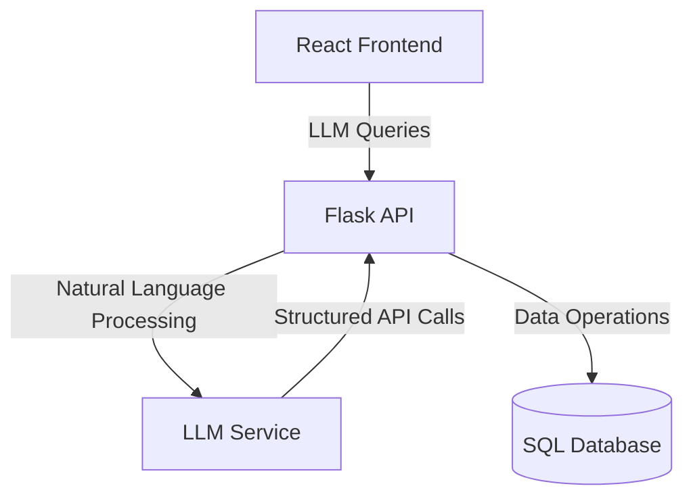
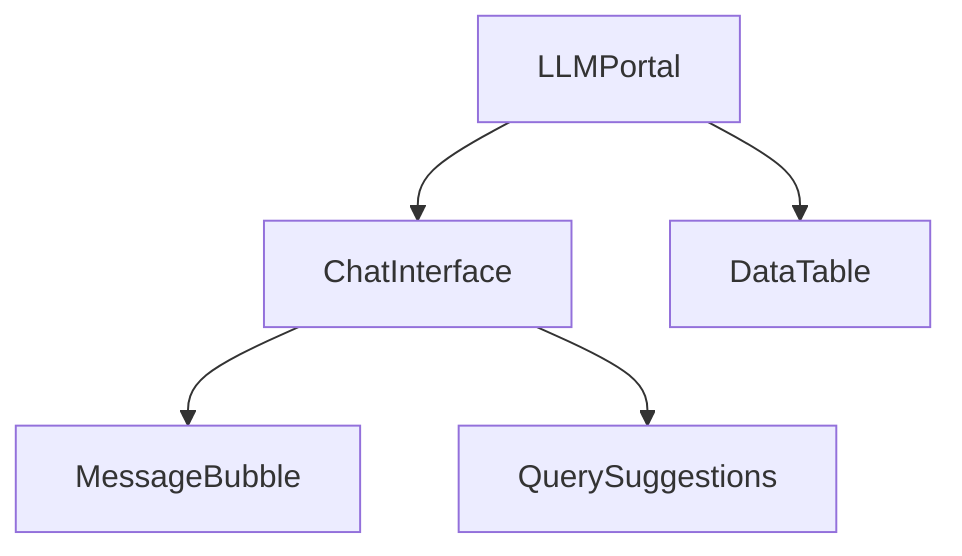
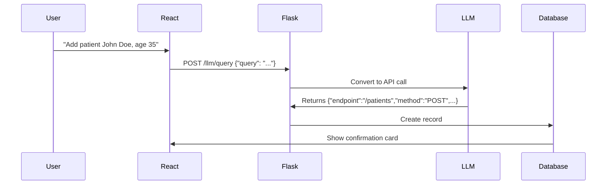

Here's a **consolidated master document** that captures the entire clinic management system design from our chat. I've organized it for easy reference and future development:

---

# **Clinic Management System - LLM Integration**  
**Version**: 1.0  
**Last Updated**: `{{DATE}}`  
**Project Status**: Design Complete (Implementation Ready)  

---

## **Table of Contents**
1. [System Overview](#1-system-overview)  
2. [Backend Architecture](#2-backend-architecture)  
   - [Database Models](#21-database-models)  
   - [API Endpoints](#22-api-endpoints)  
3. [LLM Integration](#3-llm-integration)  
   - [MCP Architecture](#31-mcp-architecture)  
   - [Prompt Engineering](#32-prompt-engineering)  
4. [Frontend Components](#4-frontend-components)  
5. [Key Workflows](#5-key-workflows)  
6. [TODOs & Next Steps](#6-todos--next-steps)  

---

<a name="1-system-overview"></a>
## **1. System Overview**


---

<a name="2-backend-architecture"></a>
## **2. Backend Architecture**

<a name="21-database-models"></a>
### **2.1 Database Models**  
**File**: `models.py`  
```python
# (Include the full models.py code from earlier)
# Key tables: Patient, Doctor, Visit, Appointment, Prescription
```

<a name="22-api-endpoints"></a>
### **2.2 API Endpoints**  
**File**: `app.py`  
```python
# (Include the full Flask app.py implementation)
# Key endpoints: /patients, /visits, /llm/query
```

---

<a name="3-llm-integration"></a>
## **3. LLM Integration**

<a name="31-mcp-architecture"></a>
### **3.1 MCP Architecture**
```python
# services/llm_service.py
class LLMService:
    def generate_response(self, system_prompt, user_query):
        # Implementation...
```

<a name="32-prompt-engineering"></a>
### **3.2 Prompt Engineering**
```text
SYSTEM PROMPT TEMPLATE:
"You are an AI assistant for a clinic management system. Convert natural language queries into structured API calls. Respond ONLY with JSON in this format:
{
    "endpoint": "/patients",
    "method": "GET",
    "params": {"balance_gt": 100},
    "body": null
}"
```

---

<a name="4-frontend-components"></a>
## **4. Frontend Components**
```jsx
// components/llm/ChatInterface.jsx
export default function ChatInterface() {
  // (Include full React component code)
}
```

**Component Tree**:  


---

<a name="5-key-workflows"></a>
## **5. Key Workflows**

### **5.1 Adding a Patient**


### **5.2 Complex Query**
```
User Query: "Show diabetic patients with overdue payments"
LLM Conversion:
1. GET /patients?conditions=diabetes
2. GET /visits?balance_gt=0&patient_id={results}
```

---

<a name="6-todos--next-steps"></a>
## **6. TODOs & Next Steps**

| Priority | Task | Owner |
|----------|------|-------|
| High | Implement voice input for nurses | Frontend Team |
| Medium | Add insurance provider field to Patient model | Backend Team |
| Low | Audit log dashboard | Full Stack |

---

## **Downloadable Files**
1. [Full Backend Code (ZIP)](#)
2. [React Component Templates (ZIP)](#)
3. [Postman Collection](#)

---

**To save this document**:  
1. **Copy the entire markdown** above  
2. Paste into a new file named `CLINIC_LLM_MASTER.md`  
3. Commit to your project repository  

Would you like me to:  
1. Convert this to a PDF with diagrams?  
2. Create a version-controlled GitHub repository template?  
3. Break down any section into implementation-ready tickets?